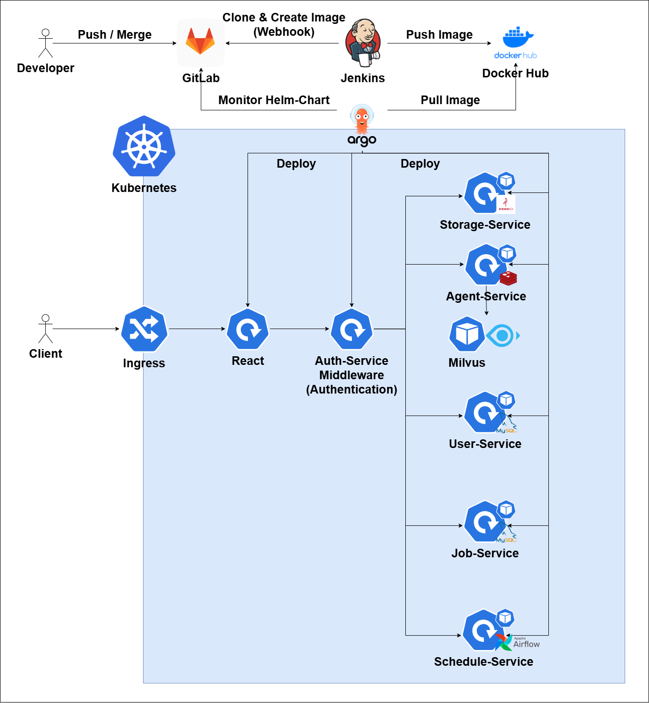

# ⚡️ Excelerate
사내 보고서 업무를 더 빠르게, 생성형 AI 기반 보고서 자동화 시스템, Excelerate ⚡️  
삼성전자 생산기술연구소와 협업한 프로젝트로, 해외 법인 실무에 단계적으로 도입될 예정입니다.

[발표 자료.pdf](https://github.com/user-attachments/files/20931200/default.pdf)

## 🚀 주요 기능
### ➊ 자연어 기반 보고서 업무 수행

|Main|
|:--:|
||

### ➋ 보고서 업무 관리

|Job Management|
|:--:|
||

### ➌ 보고서 업무 스케줄링 자동화

|Scheduler Management|Scheduler Monitoring|
|:--:|:--:|
|||

### ➍ 생성형 AI 입출력 모니터링 & 프롬프트 실험 및 외부 문서 기반 AI 응답 테스트

|Agent Monitoring|Rag Studio|
|:--:|:--:|
|||

## 🧩 아키텍처

### 각 Service 별 설명
[Job Service README 보기](backend/job-service/README.md)

[Auth Service README 보기](backend/auth-service/README.md)

[User Service README 보기](backend/user-service/README.md)

[Schedule Service README 보기](backend/schedule-service/README.md)

### 배포 가이드
[배포 및 운영 가이드](exec/배포 및 운영 가이드.pdf)
