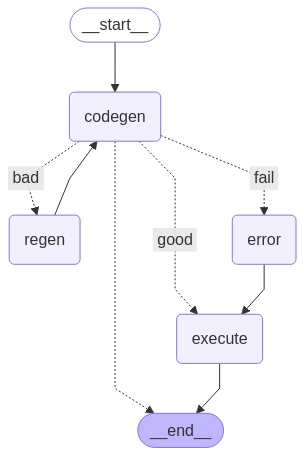

Agent 구조

그래프 모양


입력 받은 command_list로 부터 code 생성

code가 잘 생성되면 종료. code가 안좋으면(bad) 재생성. 3번이상 bad가 뜨면 fail로 에러 메시지를 출력 후 종료

상태 구조
```
class AgentState(MessagesState):
    command_list: List[str]
    python_code: str
    dataframe: pd.DataFrame
    retry_count: int 
```