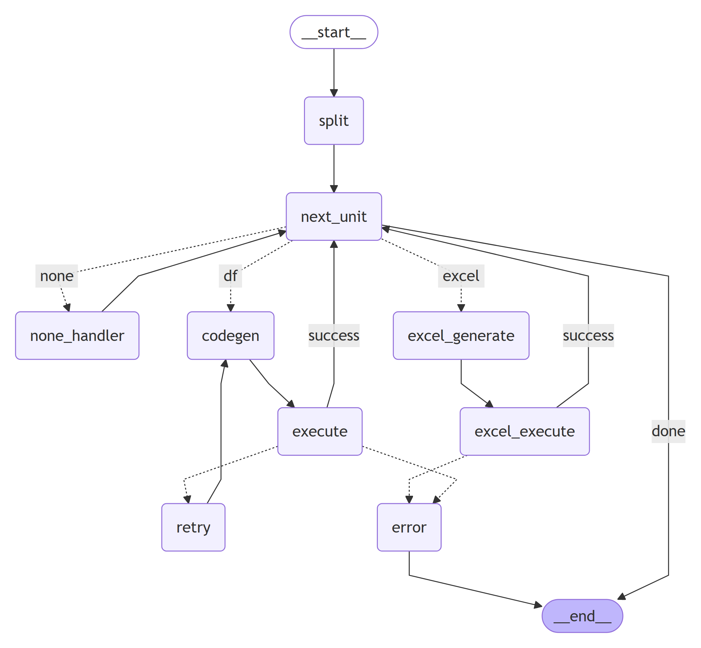

Agent 구조

그래프 모양


입력 받은 command_list를 split 한뒤 각 list에 대해 code 생성

생성된 코드 실행 후 성공하면 완료. 실패 시 3번까지 재생성. 최종 실패 시 error 메시지를 남기고 종료

상태 구조
```
class AgentState(MessagesState):
    command_list: List[str]
    queue_idx: int # 현재 진행중인 큐
    classified_cmds: List[dict] # 타입 분류된 커맨드 리스트
    current_unit: Optional[Dict[str, str]] = Field(None, description="현재 실행 중인 명령 단위(cmd, type)")
    python_code: str
    python_codes_list: List[str] # 각 단계별 코드 리스트 모음
    dataframe: List[pd.DataFrame]
    retry_count: int
    error_msg: dict | None
    logs: List[LogDetail]
    download_token: str
    stream_id: str
    original_code: str | None
```