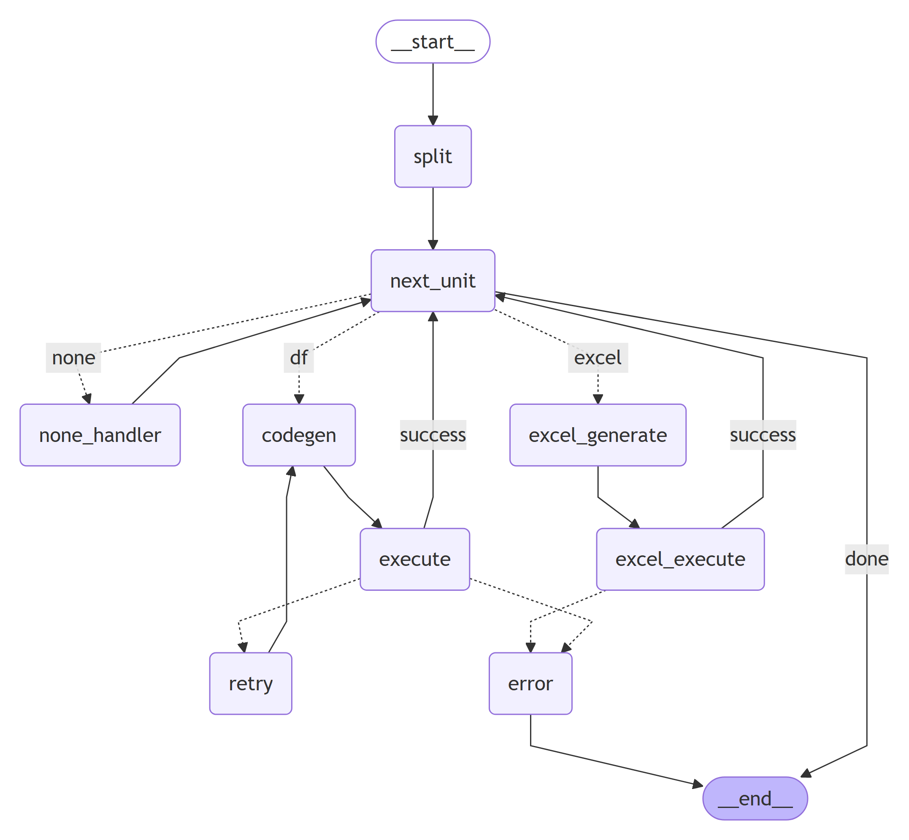

## 목차
- [Excelerate Agent Server](#excelerate-agent-server)
- [주요 기능](#주요-기능)
- [기술 스택](#기술-스택)
- [프로젝트 디렉토리 구조](#프로젝트-디렉토리-구조)
- [엔드포인트 구조](#엔드포인트-구조)
- [프로젝트 초기 설정](#프로젝트-초기-설정)
- [로깅 메커니즘](#로깅-메커니즘)
- [그래프 구조](#그래프-구조)

## Excelerate Agent Server

Excel을 자동화하는 에이전트를 제공하는 FastAPI 서버입니다. LLM을 활용해 DataFrame 조작 코드 생성, Excel 템플릿 삽입, 데이터 로드, 로그 스트리밍 등을 수행합니다.

## 주요 기능

- Chat Prompt 관리: Agent 별 Chat Prompt 템플릿 등록/수정/삭제

- 데이터 로드: RAG를 통한 파라미터 추출 및 Storage-Server API 호출로 데이터 불러오기

- 커맨드 생성: DataFrame 조작(df), Excel 템플릿 삽입(excel), 일반 명령어 처리(none)로 입력된 커맨드를 분류해 코드 생성 및 실행 결과 반환

- Excel 템플릿 관리: MinIO에 템플릿 저장/불러오기 및 미리 보기, 다운로드 지원

- 로그 스트리밍: SSE(Server-Sent Events)를 이용한 실시간 로그 전송

- 인증 & 권한: Auth-Server를 통해 JWT 기반 인증 지원

- Redis: 로그 및 Chat Prompt 관리

- MinIO: 템플릿 저장 및 결과 업로드

## 기술 스택

- Python 3.10+

- FastAPI 0.115.12

- Uvicorn 0.34.2

- Redis

- MinIO

- Milvus 2.4.17

- LangChain 0.3.24

- LangGraph 0.3.34

## 프로젝트 디렉토리 구조

```
agent-service
├─ app
│  ├─ api
│  │  └─ v1
│  │     └─ endpoints                 # 컨트롤러 디렉토리
│  │        ├─ chatprompt.py
│  │        ├─ code_gen.py
│  │        ├─ data_load.py
│  │        ├─ download.py
│  │        ├─ log.py
│  │        ├─ template.py
│  │        └─ __init__.py
│  ├─ core                            # 환경 변수, 인증 설정
│  │  ├─ auth.py
│  │  ├─ config.py
│  │  └─ __init__.py
│  ├─ models                          # Pydantic Model 정의
│  │  ├─ chatprompt.py
│  │  ├─ log.py
│  │  ├─ query.py
│  │  ├─ structure.py
│  │  └─ __init__.py
│  ├─ services                        # 서비스 디렉토리
│  │  ├─ chatprompt_service.py
│  │  ├─ code_gen                         # Code Generator 관련 서비스
│  │  │  ├─ graph.py
│  │  │  ├─ graph_image
│  │  │  │  └─ output.png
│  │  │  ├─ graph_util.py
│  │  │  ├─ merge_utils.py
│  │  │  └─ readme.md
│  │  ├─ data_load                        # Data Loader 관련 서비스
│  │  │  ├─ datachain.py
│  │  │  ├─ data_util.py
│  │  │  └─ makerag.py
│  │  ├─ template.py                      # 템플릿 관련 서비스
│  │  └─ __init__.py
│  ├─ utils                           # docs, 의존성, 함수, logger, db 연결 등 util 모음
│  │  ├─ api_utils.py
│  │  ├─ depend.py
│  │  ├─ docs.py
│  │  ├─ memory_logger.py
│  │  ├─ minio_client.py
│  │  ├─ promptmaker.md
│  │  ├─ redis_chatprompt.py
│  │  ├─ redis_client.py
│  │  └─ __init__.py
│  └─ main.py                         # FastAPI Server Application
├─ Dockerfile
├─ readme.md
└─ requirements.txt
```

## 엔드포인트 구조
모든 엔드포인트는 prefix로 `/api/agent`를 가지며, 각 라우터마다 추가적인 prefix를 갖는다.

#### data_load `/data`
자연어로 데이터를 불러오거나 (Data Loader) RAG를 위해 공장 정보를 milvus에 저장하는 등 제조 시스템 관련 역할을 수행

#### code_gen `/code`
사용자의 명령어를 받아 코드와 데이터 프레임, 엑셀 파일을 생성하는 Agent (Code Generator)

#### template `/template`
엑셀 작업에 사용할 템플릿을 조회/추가/삭제/미리보기/다운로드

#### download `/download`
Code Generator로 인해 생성된 엑셀 파일을 다운로드 하는 API 제공공

#### log `/logs`
Agent 동작 시 생성된 로그/로그 목록을 조회하거나, 실시간 로그 스트림이 가능한 SSE API 제공공

#### chatprompt `/prompts`
각 Agent에서 사용 될 ChatTemplatePrompts를 등록/조회/수정/삭제하고, 플레이 그라운드에서 A/B 테스트할 때 사용할 API 제공

## 프로젝트 초기 설정
1. 공장 정보 vector DB 등록
`POST` `/api/agent/data/make` API를 사용해 공장 정보를 Milvus에 등록합니다.
다음과 같은 구조로 등록하면 됩니다.
``` json
{
    "data": [
        {
            "factory_name": "수원공장",
            "system_name": "mes",
            "factory_id": "FCT001",
            "product": {
                "PROD001": { "name": "스마트폰A", "category": "전자기기" },
                "PROD002": { "name": "스마트폰B", "category": "전자기기" },
                "PROD004": { "name": "노트북D", "category": "컴퓨터"   }
            },
            "metric_list": ["defects", "production", "inventory", "energy"]
        },
        {
            "factory_name": "평택공장",
            "system_name": "mes",
            "factory_id": "FCT002",
            "product": {
                "PROD003": { "name": "태블릿C", "category": "전자기기" },
                "PROD005": { "name": "데스크탑E", "category": "컴퓨터" }
            },
            "metric_list": ["defects", "production", "inventory", "energy"]
        }
    ]
}
```
실 서비스에선 더미 데이터가 아닌 MES와 연결해 사용하므로 대체하시면 좋습니다.


2. Agent 별 ChatPrompt 등록
`POST` `/api/agent/prompts` API를 사용해 utils 폴더 내의 promptmaker.md에 있는 내용을 서버의 Redis에 등록합니다.
총 6개의 프롬프트를 등록하시면 됩니다.

Code Generator
- Generate Code Extension
- Generate Code
- Manipulate Excel
- Split Command List

Data Loader
- Extract DataCall Params
- Transform Date Params


## 로깅 메커니즘
app/utils/memory_logger.py 를 활용해 로그를 남기고자 하는 llm의 로그를 수집합니다.
llm 시작 시 prompt와 시간을 저장하고, llm 종료 시 output과 지연 시간, 메타데이터를 log 형태로 저장합니다.

logger에 저장된 로그는 redis와 log_queue를 이용해 저장 및 스트리밍 됩니다.

1. LLM 호출 시 logger를 callbacks로 지정한다.
``` py
class CodeGenerator:
    def __init__(self):
        self.logger = MemoryLogger()
        self.minio_client = MinioClient()
        self.sllm = ChatOpenAI(model_name="gpt-4.1-mini", temperature=0, callbacks=[self.logger])
        self.q = None
```

2. 이 후 LLM 호출을 시작 위치에서 logger를 초기화하고, 호출이 끝난 후 logger의 데이터를 불러와 저장한다.
``` py
# logger 초기화 - /service/code_gen/graph.py line 63
self.logger.set_name("LLM Call: Split Command List")
self.logger.reset()

... # LLM invoke 작업 수행

# log 저장 - - /service/code_gen/graph.py line 125
llm_entry = self.logger.get_logs()[-1] if self.logger.get_logs() else None
new_logs  = state.get("logs", []) + ([llm_entry] if llm_entry else [])
```

3. 필요한 위치에서 로그를 스트리밍하고, 호출 종료 시 Redis에 metadata를 붙여 저장한다.
``` py
# 큐 불러오기 - /service/code_gen/graph.py line 65
self.q = get_log_queue(state["stream_id"])

# stream_id로 쏘기 - /service/code_gen/graph.py line 128
if llm_entry:
    log = log_filter(llm_entry)
    self.q.put_nowait({"type": "log", "content": log})

# Redis에 로그 저장하기 - /api/v1/endpoints/code_gen.py line 93
save_logs_to_redis(log_id, answer["logs"], metadata={
    "agent_name":  "Code Generetor",
    "log_detail":  "코드를 생성합니다.",
    "total_latency": api_latency
})
```

저장되는 로그의 구조는 다음과 같습니다.
``` json
{
    "metadata": {
        "agent_name": "Data Loader",
        "log_detail": "데이터를 불러옵니다.",
        "total_latency": 3.824995,
        "created_at": "2025-05-20T00:07:54.259770+00:00"
    },
    "logs": [
        {
            "name": "LLM Call: Extract DataCall Params",
            "input": [
                {"role": "system", "message": "시스템 메시지"},
                {"role": "human", "message": "휴먼 메시지"}
            ],
            "output": [
                {"role": "ai", "message": "AI 메시지"}
            ],
            "timestamp": "2025-05-20T00:07:53.326562Z",
            "metadata": {
                "token_usage": {
                    "completion_tokens": 48,
                    "prompt_tokens": 958,
                    "total_tokens": 1006,
                    "completion_tokens_details": {
                        "accepted_prediction_tokens": 0,
                        "audio_tokens": 0,
                        "reasoning_tokens": 0,
                        "rejected_prediction_tokens": 0
                    },
                    "prompt_tokens_details": {
                        "audio_tokens": 0,
                        "cached_tokens": 0
                    }
                },
                "model_name": "gpt-4.1-mini-2025-04-14",
                "system_fingerprint": "fp_79b79be41f",
                "id": "chatcmpl-BZ4oHHTQjnhgGGiLkRGbaZzCctfTe",
                "finish_reason": "stop",
                "logprobs": null,
                "llm_latency": 2.19126
            },
            "sub_events": []
        }
    ]
}
```

## 그래프 구조



